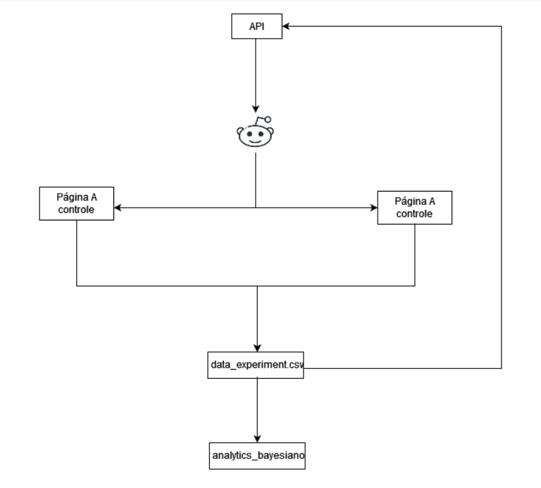
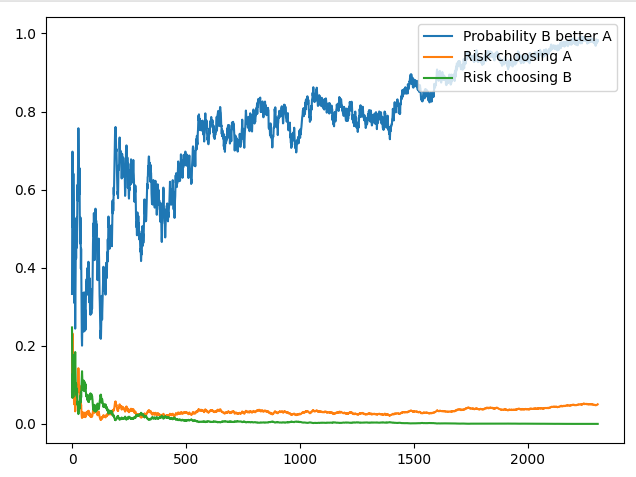

# Teste AB

## 1.Sobre o Projeto

Este projeto é o resultado de uma série de estudos realizados sobre o teste A/B, que é um método de comparação de duas versões de um produto 
ou recurso para determinar qual deles tem melhor desempenho. Nesse tipo de experimento, uma amostra aleatória de usuários é mostrada na versão A, 
enquanto outra amostra aleatória é mostrada na versão B. O comportamento dos usuários em ambos os grupos é então medido e comparado para determinar qual versão é mais eficaz. 
Esse método é amplamente utilizado em marketing, desenvolvimento de software e design de produtos para tomar decisões baseadas em dados e otimizar a experiência do usuário.

Esta contemplado nesse projeto o teste A/B frequentista que segue a descrição anterior e o teste A/B Bayesiano, que é um método de teste de hipótese estatística 
que usa a probabilidade bayesiana para atualizar crenças sobre a eficácia de diferentes versões de um produto ou recurso. 
Nessa abordagem, as crenças anteriores sobre a probabilidade de certos resultados são combinadas com os dados coletados do experimento para estimar 
as probabilidades posteriores de diferentes resultados. Essa abordagem permite atualizações flexíveis e dinâmicas de crenças à medida que mais dados 
se tornam disponíveis e pode levar a testes mais precisos e eficientes em comparação com os métodos de teste A/B frequentistas tradicionais.

Outra importante ferramenta estudada foi o MAB(multi-armed bandit) que é um problema clássico no campo da aprendizagem por reforço, 
e representa um trade-off entre exploração e "exploitação". Nesse problema, um tomador de decisão se depara com vários "braços", 
cada um dos quais oferece uma recompensa quando "jogado". O objetivo é maximizar a recompensa total ao longo do tempo, 
equilibrando a exploração de diferentes braços para saber sobre sua recompensa esperada e a exploração do braço com a maior recompensa estimada. 
Este problema modela vários cenários do mundo real, como publicidade online e sistemas de recomendação, onde o decisor deve equilibrar a exploração 
de novas opções com a exploração das opções mais conhecidas.

## 2.Tecnologias Utilizadas

**Python, Pandas, NumPy, Statsmodels, Selenium, Seaborn, Scipy, Matplotlib, Flask, Itertools, Jupyter Notebook**

## 3.Contato

  
silveira.a.n@gmail.com

  
https://www.linkedin.com/in/alexsandronsilveira/

## 4.Tópicos Desenvolvidos

**Teste A/B**

**Teste Bayesiano**

**Teste Bayesiano + MAB**
  
**Teste A/B/n:** Realiza o teste da mesma maneira que o teste convencional, mas para mais de duas amostras

## 5. Resultado

O principal resultado foi a aplicação do teste A/B Bayesiano potencializado pelo MAB, a ideia pricipal era ser capaz de avaliar entre 
duas páginas qual possuia melhor conversão o teste bayesiano permite saber qual das páginas possuem uma performance melhor e o MAB permite
cada vez mostrar mais a página vencedora. Essa estratégia impacta positivamente na taxa de conversão, pois permite a melhor página seja mais mostrada.
A figura abaixo demonstra o funcionamento do modelo de aprendizado por reforço desenvolvido.

**Passo 01 - Apresentar as páginas:** As páginas são acessadas aleatoriamente aos usuários que interagem com a página. Foram criadas páginas simples
com SIM e NÃO e com o uso de webs craping se defina a taxa de clica nas páginas, ou seja, simulavam os usuários das páginas
    
**Passo 02 - Salvar os dados de interação:** Conforme o código de webscraping ia clicando nas páginas eram salavos esses dados em um arquivo .csv
    
**Passo 03 - Carregar a API com os dados:** Eram carregados os dados para a realizção do teste A/B
    
**Passo 04 - O modelo aprende qual página é melhor:** Com o uso da estatística bayesiano o modelo vai descobrindo qual página é melhor. Com esse conhecimento 
e com o uso do MAB o modelo passa a mostrar com maior frequência a página vencedora até que passa só a mostrar ela.
    
**Passo 05 - Apresentação das análises:** Foi desenvolvido um código que mostra em forma gráfica a probabilidade da página A ser melhor que a página B
e o risco em adotar uma das páginas. Esse gráfico facilita na decisão de qual página tem melhor performance. Na figura abaixo é apresentado o gráfico.

## 6. Conclusão
    
O teste A/B usando a inferência bayesiana se mostra como uma ferramenta muito eficaz, quando usada em conjunto com a técnica do MAB potencializamos essa eficácia.
Vale lembrar que como teste frequentista precisamos definir um tamanho de amostra e passar um determinado tempo realizando a coleta de dados, além do tempo preciso 
estamos perdendo possíveis conversões ao longo do teste. Com o uso da inferência bayesiana + MAB aceleramos esse processo de decisão e já aumentamos a conversão 
quando passamos a mostrar a melhor página ao longo do teste
